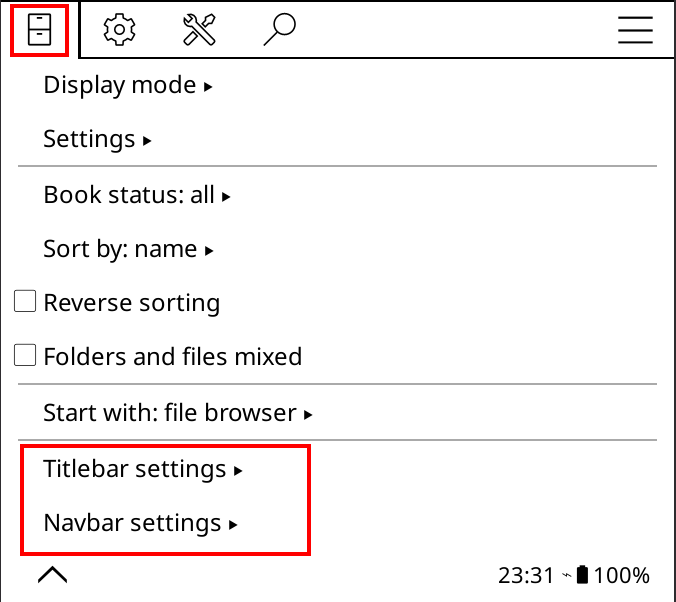

# qewer33's KOReader Patches

My custom user patches for [KOReader](https://github.com/koreader/koreader). These patches together make the default file browser view of KOReader more modern while allowing you to see more info and have quick access to things you use often. They can also be used independantly of each other.

Here's how they look on my Kobo Libra Colour!


If you like these patches and want to support me, consider getting me a coffee! :D

[](https://ko-fi.com/B0B8FQ871)

> [!WARNING]
> REGARDING **PROJECT TITLE** COMPATIBILITY
> According to community feedback, only the **quick settings** patch works with Project Title. The other patches are reported to not work well. None of the patches guarantee any sort of Project Title compatibility as I don't use it myself.

## Installation

Drop the `.lua` files into your `koreader/patches/` directory. Place all the icons in the `icons/` folder in your KOReader `icons/` directory.

## Patches

<details>
<summary>
<h3>2-custom-titlebar.lua</h3>

</summary>

Replaces the default "KOReader" title with a custom status bar showing device info.

**Left side:** Device name (configurable, defaults to device model)

**Center:** Time display (HH:MM, optional)

**Right side:** Status indicators (configurable):
- WiFi signal strength (blue when connected, red when disconnected)
- Disk usage
- RAM usage
- Frontlight level
- Battery percentage (green/yellow/red based on level)

**Features:**
- Settings menu under **File Browser > Titlebar settings**
- Configurable device name, separator style (dot, bar, dash, bullet, space, custom)
- **Items** submenu: toggle individual indicators, drag to reorder
- Optional bottom border line
- Optional bold text
- Optional colored status icons (icon characters colored, labels stay black)
- Home/plus buttons moved inline with the subtitle (path) row
- Works in both portrait and landscape orientation

</details>

<details>
<summary>
<h3>2-custom-navbar.lua</h3>

</summary>

Adds a tab bar at the bottom of the File Manager with configurable tabs:

| Tab | Action | Default |
|---|---|---|
| **Books** | Navigates to Home folder (page 1) | Always on |
| **Manga** | Opens [Rakuyomi](https://github.com/tachibana-shin/rakuyomi) or a folder | On |
| **News** | Opens [QuickRSS](https://github.com/qewer33/QuickRSS) or a folder | On |
| **Continue** | Reopens the last read document | On |
| **History** | Opens reading history | Off |
| **Favorites** | Opens favorites collection | Off |
| **Collections** | Opens collections list | Off |
| **Exit** | Exits KOReader | Off |

The active tab is highlighted with a bold label and underline. The active tab automatically switches when navigating between configured folders (e.g. browsing into the Manga folder activates the Manga tab). Tabs for uninstalled plugins show an info message when tapped.

The navbar also appears in standalone views (History, Favorites, Collections, Rakuyomi, and QuickRSS), allowing quick navigation between tabs without returning to the file browser first.

**Features:**
- Settings menu under **File Browser > Navbar settings**
- **Tabs** submenu: toggle individual tabs, drag to reorder, configure per-tab settings
- Configurable Books tab label (Books, Home, Library, or custom)
- Manga and News tabs can be set to open a folder instead of their default plugin
- Active tab auto-switches based on the current folder path
- **Active tab** submenu: toggle styling, bold, underline, underline location (above/below), colored active tab
- Option to disable labels (icons only)
- Optional top border line
- **Advanced** submenu: toggle navbar in standalone views, toggle top gap spacing
- Refresh navbar button to apply changes without restarting
- **Custom icons:** All tab icons use `tab_<name>.svg` files from the `icons/` folder, which can be swapped to customize the look

</details>

<details>
<summary>
<h3>2-quick-settings.lua</h3>

</summary>

Adds a Quick Settings tab as the first tab in the KOReader top menu. Provides fast access to common actions and device controls without navigating through menus.

**Action buttons** (circular icons with labels):
- Wi-Fi (shows connected SSID, active indicator when connected)
- Night mode (active indicator when enabled)
- Rotate screen
- USB mass storage
- Calibre wireless connection (active indicator when connected, disabled by default)
- Restart (with confirmation)
- Exit (with confirmation)
- Sleep/Suspend

**Sliders:**
- Frontlight brightness: `[−] [slider] [+] [Max]` with tappable progress bar
- Warmth (if device supports it): `[−] [segmented bar] [+] [Max]`

**Features:**
- Settings menu under **Settings > Quick settings**
- **Buttons** submenu: toggle individual buttons, drag to reorder
- Toggle frontlight and warmth sliders independently
- "Always open on this tab" option to default to Quick Settings when the menu opens
- Active buttons show a light gray fill indicator
- Works in both File Manager and Reader views

</details>

<details>
<summary><h3>2-hide-pagination.lua</h3></summary>

Removes the pagination bar (`« < Page 1 of 2 > »`) from the file browser, history, favorites, and collections views. The mosaic/list grid stretches to fill the reclaimed space. Swipe gestures for page navigation still work.

</details>

## Patch Settings

The Titlebar and Navbar patches can be configured from their respective settings under the first KOReader menu tab.



The Quick Settings patch can be configured from "Settings" (Gear icon) -> "Quick settings".


## Deploy Script

`deploy_patch.sh` copies all `.lua` files and icons to the local KOReader patches/icons directory and restarts KOReader, useful for development.

```sh
./deploy_patch.sh
```
